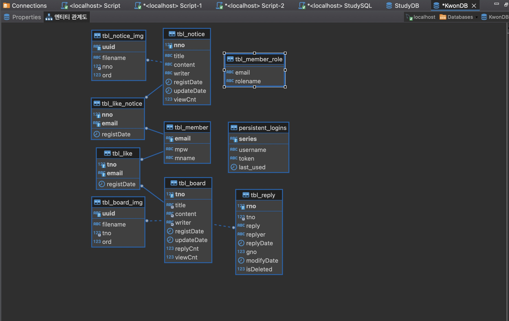

<p align='center'>
  <a href="#demo">
<body>
  <h2>기술 스택</h2>
  <p>
    
    
    
    
    
    
    
    
    
    
  </p>
</body>
</html>

# 개발 상태 : [개발 완료]
## 개발자 정보
- 이름: [권성준]
- 이메일: [thistrik@gmail.com]
- 이메일: [thistrik@naver.com]

## 피드백 기여 및 지원 기타 문의 
- 프로젝트에 대한 의견과 피드백은 언제나 환영합니다! 만약 프로젝트에 대한 개선 사항이나 버그 제보, 그 외 다른 의견이 있으시면, 언제든지 연락해주시기 바랍니다.

### 주요 기능
| 기능               | 설명                                                              |
|------------------|-----------------------------------------------------------------|
| **Board 기능**     | Board 항목의 생성, 조회, 수정, 삭제를 지원합니다. 게시물 검색, 필터링 및 정렬, 페이지네이션 기능이 있습니다. |
| **Reply 기능**     | Reply 항목의 생성, 조회, 수정, 삭제를 지원하며, 페이지네이션 기능이 있습니다. |
| **File 기능**      | File 항목의 생성, 조회, 수정, 삭제를 지원합니다. 생성/수정 시에는 썸네일이 생성되며, Ajax 통신은 NGINX를 통해 이루어집니다. |
| **공지사항 기능**  | 공지사항 항목의 생성, 조회, 수정, 삭제를 지원합니다. 공지사항 게시물 검색, 필터링 및 정렬, 페이지네이션 기능이 있으며, 게시물 리스트 상단에 공지사항을 고정할 수 있습니다. |
| **좋아요 기능**    | 회원을 통한 좋아요 생성, 삭제, 그리고 좋아요 수 카운트를 지원합니다. |
| **조회수 기능**    | 쿠키를 통해 조회수를 생성합니다.                                   |
| **웹 디자인**     | Bootstrap을 이용한 반응형 웹 디자인을 지원합니다.                      |

## 부트스트랩 사용
이 프로젝트는 부트스트랩 템플릿을 사용하여 사용자 인터페이스를 구성합니다. 템플릿에 대한 자세한 정보는 [AdminLTE](https://adminlte.io/)를 참조하세요.

## Database_Diagram


# Database Indexing
다음은 데이터베이스 내 각 테이블에 대한 인덱싱 방법을 안내합니다. 

## tbl_board
`tbl_board` 테이블에 대해 `title`, `content`, `writer` 필드에 인덱스를 추가합니다:
```sql
ALTER TABLE tbl_board ADD INDEX idx_title (title);
ALTER TABLE tbl_board ADD INDEX idx_content (content);
ALTER TABLE tbl_board ADD INDEX idx_writer (writer);
```

## tbl_notice
`tbl_notice` 테이블에 대해 `title`, `content`, `writer` 필드에 인덱스를 추가합니다:
```sql
ALTER TABLE tbl_notice ADD INDEX idx_title (title);
ALTER TABLE tbl_notice ADD INDEX idx_content (content);
ALTER TABLE tbl_notice ADD INDEX idx_writer (writer);
```

## tbl_reply
`tbl_reply` 테이블에 대해 `tno`, `replyer` 필드에 인덱스를 추가합니다:
```sql
ALTER TABLE tbl_reply ADD INDEX idx_tno (tno);
ALTER TABLE tbl_reply ADD INDEX idx_replyer (replyer);
```

## tbl_member & tbl_member_role
`tbl_member` 및 `tbl_member_role` 테이블에 대해 email 필드에 인덱스를 추가합니다:
```sql
ALTER TABLE tbl_member ADD INDEX idx_email (email);
ALTER TABLE tbl_member_role ADD INDEX idx_email (email);
```

## tbl_like, tbl_board_img, tbl_like_notice, tbl_notice_img
`tbl_like`, `tbl_board_img`, `tbl_like_notice`, `tbl_notice_img` 테이블에 대해 외래키 필드에 인덱스를 추가합니다:
```sql
ALTER TABLE tbl_like ADD INDEX idx_tno (tno);
ALTER TABLE tbl_like ADD INDEX idx_email (email);

ALTER TABLE tbl_board_img ADD INDEX idx_tno (tno);

ALTER TABLE tbl_like_notice ADD INDEX idx_nno (nno);
ALTER TABLE tbl_like_notice ADD INDEX idx_email (email);

ALTER TABLE tbl_notice_img ADD INDEX idx_nno (nno);
```
이렇게 README 파일에 작성하면, 각 테이블에 대한 인덱스 추가 방법을 쉽게 파악하고 참조할 수 있습니다. 이 문서를 필요에 따라 수정하거나 확장해서 사용하시면 됩니다.


SQL 스키마:
```sql

CREATE TABLE tbl_board (
	tno int AUTO_INCREMENT PRIMARY KEY,
	title varchar(500) NOT NULL,
	content varchar(700) NOT NULL,
	writer varchar(100) NOT NULL,
	registDate TIMESTAMP DEFAULT NOW(),
	updateDate TIMESTAMP DEFAULT NOW(),
	replyCnt INT DEFAULT 0,
	viewCnt INT DEFAULT 0
)
;

CREATE TABLE tbl_like (
    tno INT NOT NULL,
    email VARCHAR(100) NOT NULL,
    registDate TIMESTAMP DEFAULT NOW(),
    PRIMARY KEY (tno, email),
    FOREIGN KEY (tno) REFERENCES tbl_board(tno) ON DELETE CASCADE,
    FOREIGN KEY (email) REFERENCES tbl_member(email) ON DELETE CASCADE
)
;

CREATE TABLE tbl_board_img (
	uuid varchar(50) PRIMARY KEY,
	filename varchar(200) not null,
	tno int not null,
	ord int default 0,
	FOREIGN KEY (tno) REFERENCES tbl_board(tno) ON DELETE CASCADE
)
;

CREATE TABLE tbl_reply (
    rno INT AUTO_INCREMENT PRIMARY KEY,
    tno INT NOT NULL,
    reply VARCHAR(1000) NOT NULL,
    replyer VARCHAR(100) NOT NULL,
    replyDate TIMESTAMP DEFAULT NOW(),
    modifyDate TIMESTAMP DEFAULT NOW(),
    gno INT DEFAULT 0,
    isDeleted TINYINT DEFAULT 0,
    FOREIGN KEY (tno) REFERENCES tbl_board(tno) ON DELETE CASCADE
)
;

CREATE TABLE tbl_notice (
    nno INT AUTO_INCREMENT PRIMARY KEY,
    title VARCHAR(500) NOT NULL,
    content VARCHAR(700) NOT NULL,
    writer VARCHAR(100) NOT NULL,
    registDate TIMESTAMP DEFAULT NOW(),
    updateDate TIMESTAMP DEFAULT NOW(),
    viewCnt INT DEFAULT 0
)
;

CREATE TABLE tbl_like_notice (
    nno INT NOT NULL,
    email VARCHAR(100) NOT NULL,
    registDate TIMESTAMP DEFAULT NOW(),
    PRIMARY KEY (nno, email),
    FOREIGN KEY (nno) REFERENCES tbl_notice(nno) ON DELETE CASCADE,
    FOREIGN KEY (email) REFERENCES tbl_member(email) ON DELETE CASCADE
)
;

CREATE TABLE tbl_notice_img (
    uuid VARCHAR(50) NOT NULL PRIMARY KEY,
    filename VARCHAR(200) NOT NULL,
    nno INT NOT NULL,
    ord INT NOT NULL,
    FOREIGN KEY(nno) REFERENCES tbl_notice(nno) ON DELETE CASCADE
)
;

CREATE TABLE tbl_member (
	email varchar(100) PRIMARY KEY,
	mpw varchar(100) NOT NULL,
	mname varchar(100) NOT NULL
)
;

CREATE TABLE tbl_member_role (
	email varchar(100) not null,
	rolename varchar(50) not null
)
;

create table persistent_logins (
       username varchar(64) not null,
       series varchar(64) primary key,
       token varchar(64) not null,
       last_used timestamp not null
)
;

```
